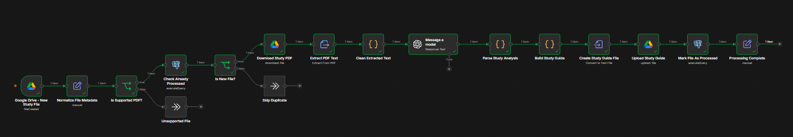
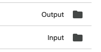
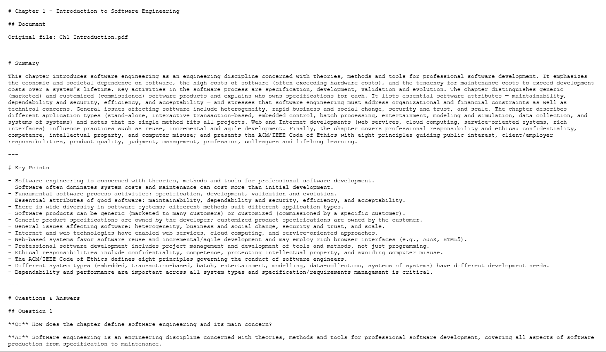
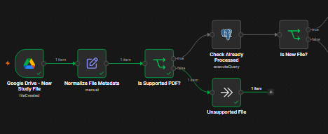
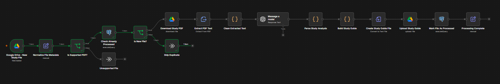

# n8n Drive Study Assistant

An AI-powered study automation built with **n8n**, **Google Drive**, **OpenAI**, **Supabase**, and **PostgreSQL**.

This workflow automatically processes PDF study files uploaded to Google Drive, generates structured study material using AI, and uploads the final study guide back to Google Drive.

It also prevents duplicate processing and ignores unsupported files.

---

## What it does

- Detects new PDF files uploaded to Google Drive
- Validates the uploaded file type
- Checks if the file has already been processed
- Downloads the PDF automatically
- Extracts text from the PDF
- Cleans and validates the extracted text
- Sends the content to an AI model
- Generates:
  - Summary
  - Key points
  - Questions and answers
  - Flashcards
- Creates a Markdown study guide
- Uploads the generated file back to Google Drive
- Saves processed file information in Supabase / PostgreSQL
- Prevents duplicate processing

---

## Tools used

- n8n
- Google Drive
- OpenAI
- Supabase
- PostgreSQL
- JavaScript
- Markdown

---

## Screenshots

### Workflow



---

### Google Drive Folders

The project uses separate `Input` and `Output` folders.



---

### Input File

Example PDF uploaded to the Input folder:


---

### Generated File

The final Markdown file is uploaded automatically to the Google Drive Output folder.


---

### Generated Study Guide

The workflow creates a structured study guide containing summaries, key points, questions, answers, and flashcards.



---

### Unsupported File Check

If the uploaded file is not a supported PDF, the workflow stops processing it.



---

### Duplicate Check

Before processing a PDF, the workflow checks the database to make sure the file was not processed before.



---

## Example AI output

The AI returns structured data similar to:

```json
{
  "title": "Chapter 1 - Introduction to Software Engineering",
  "summary": "This chapter introduces the fundamentals of software engineering.",
  "key_points": [
    "Software engineering focuses on professional software development.",
    "Maintenance is an important part of the software lifecycle.",
    "Software quality includes maintainability, dependability, efficiency, and acceptability."
  ],
  "questions": [
    {
      "question": "What is software engineering?",
      "answer": "Software engineering is an engineering discipline concerned with all aspects of software production."
    }
  ],
  "flashcards": [
    {
      "front": "Software Engineering",
      "back": "The systematic application of engineering principles to software development."
    }
  ]
}
```

The workflow converts this structured AI response into a readable study guide.

---

## Example

Input file:

```text
Ch1 Introduction.pdf
```

Generated output:

```text
Ch1 Introduction_Study_Guide.md
```

The generated study guide contains:

```text
Summary
Key Points
Questions & Answers
Flashcards
```

---

## How it works

```text
Google Drive Trigger
        ↓
Normalize File Metadata
        ↓
Check File Type
        ↓
Check Duplicate
        ↓
Download PDF
        ↓
Extract PDF Text
        ↓
Clean Extracted Text
        ↓
OpenAI Analysis
        ↓
Parse AI Output
        ↓
Build Study Guide
        ↓
Create Markdown File
        ↓
Upload to Google Drive
        ↓
Save Processing Record
```

---

## Database

Supabase / PostgreSQL is used to prevent duplicate file processing.

```sql
CREATE TABLE IF NOT EXISTS processed_files (
    id BIGSERIAL PRIMARY KEY,
    file_id TEXT UNIQUE NOT NULL,
    file_name TEXT NOT NULL,
    mime_type TEXT,
    output_file_id TEXT,
    processed_at TIMESTAMPTZ DEFAULT NOW()
);
```

Each processed Google Drive file is stored using its unique file ID.

---

## Why I built this

I built this project to practice workflow automation, AI integration, file processing, databases, and external service integrations using n8n.

The goal was to create a practical automation that can help students automatically convert study materials into useful summaries, questions, answers, and flashcards.

This project is designed as a portfolio project and does not contain real private user data.

---

## Project structure

```text
n8n-drive-study-assistant/
│
├── README.md
├── workflow.json
│
└── screenshots/
    ├── workflow.png
    ├── input-output.png
    ├── input-file.png
    ├── unsupported-file.png
    ├── duplicate-check.png
    ├── result.png
    ├── result-file.png
    └── example.png
```

---

## Setup

1. Import `workflow.json` into n8n.
2. Connect your Google Drive account.
3. Connect your OpenAI credentials.
4. Connect PostgreSQL / Supabase.
5. Create the `processed_files` table.
6. Set the Google Drive Input and Output folder IDs.
7. Activate the workflow.
8. Upload a PDF into the Input folder.
